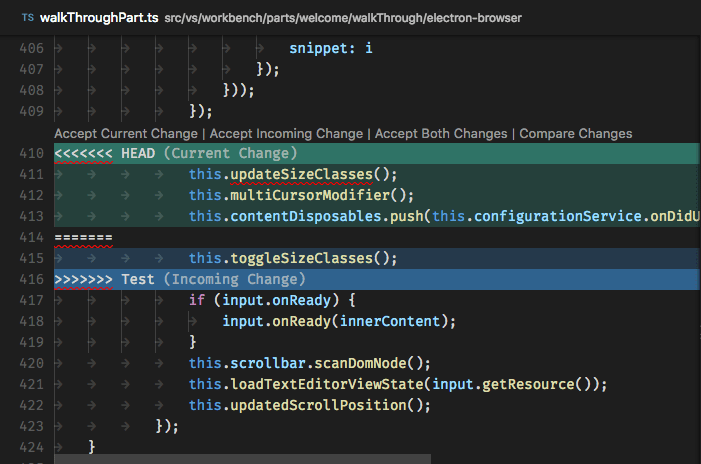

# Работа с Git
## 1. Проверка наличия установленного Git.
В терминале выполнить команду `git version`.


Если Git установлен, то появится сообщение с информацией о версии программы. Иначе появится сообщение об ошибке.
## 2. Установка Git

Загружаем последнюю версию Git  с сайта ...
Устанавливаем с настройками по умолчанию.

## 3. Настройка Git 
При первом использовании Git нужно представиться. Для этого нужно ввести в терминале две команды:
```
git config --global user.name "Имя пользователя"
git config --user.email "example@mail.ru"
```

## 4. Инициализация репозитория

Создать пустой репозиторий Git или вновь инициализировать существующий можно командой `git init`. При инициализации он создаст скрытую папку. В ней содержатся все объекты и ссылки, которые Git использует и создаёт в истории работы над проектом.
## 5. Проверка статуса репозитория

Просмотреть статус нужного репозитория можно по команде `git status`. Ее действие распространяется на подготовленные, неподготовленные и неотслеживаемые файлы.

## 6. Добавление отдельных файлов или всех файлов в область подготовленных файлов

Добавить отдельный файл в область подготовленных файлов можно параметром add с указанием имени файла. Просто замените `somefile.js` на актуальное имя.

```
git add somefile.js
```
Кроме того, можно добавить все файлы и папки в эту область, предоставив wildcard `. `вместо имени файла:

```
git add .
```

## 7. Внесение изменений однострочным сообщением или через редактор

При создании коммита в репозитории можно добавить однострочное сообщение с помощью параметра `commit` с флагом `-m`. Само сообщение вводится непосредственно после флага, в кавычках.
```
git commit -m "Your short summary about the commit"
```
Также можно открыть текстовый редактор в терминале для написания полного сообщения коммита. Оно может состоять из нескольких строк текста, в котором подробно характеризуются изменения, внесённые в репозиторий.

```
git commit
```

## 8. Просмотр истории ихменений до коммита

Можно просматривать список изменений, внесённых в репозиторий, используя параметр `diff`. По умолчанию отображаются только изменения, не подготовленные для фиксации.

```
git diff
```
Для просмотра подготовленных изменений необходимо добавить флаг `--staged`.

```
git diff --staged
```


## 9. Посмотреть журнал коммитов в репозитории

По умолчанию (без аргументов) `git log` перечисляет коммиты, сделанные в репозитории в обратном к хронологическому порядке — последние коммиты находятся вверху.


## 10. Отмена подготовленных и неподготовленных изменений

Восстановить файлы рабочего дерева, не подготовленные к коммиту, можно параметром `checkout`. Для проведения операции требуется указать путь к файлу. Если путь не указан, параметр `git checkout` изменит указатель `HEAD`, чтобы задать указанную ветку как текущую.
```
git checkout somefile.js
```
Восстановить подготовленный файл рабочего дерева можно параметром `reset`. Потребуется указать путь к файлу, чтобы убрать его из области подготовленных файлов. При этом не будет производиться откат никаких изменений или модификаций — однако файл перейдёт в категорию не подготовленных к коммиту.

```
git reset HEAD somefile.js
```
Если нужно выполнить это действие для всех подготовленных файлов, путь к ним указывать не надо.
```
git reset HEAD
```

## 11. Перемещение между коммитами.
 
 Для переключения на нужный коммит используется действие `checkout`.


После переключения, все файлы в проекте станут такими, какими они были в данном коммите.


```
git checkout commit
```

Где `commit` - это хеш (обозначение, имя) коммита, причем можно указывать не весь хеш, а несколько начальных символов хеша.


# 12. Создание новой ветки в Git

Для того, чтобы создать новую ветку используем команду `git branch`

```
git branch <имя ветки>
```
 Чтобы одновремнно создать новую ветку и переместиться в нее используем команду `checkout` с флагом `-b`:
 ```
 git -b <имя ветки>
 ```

# 13. Слияние веток в Git!!!

Команда `git merge` используется для слияния одной или нескольких веток в текущую. Затем она устанавливает указатель текущей ветки на результирующий коммит.

```
git merge <название ветки, которую собираемся слить>
```
# 14. Разрешение конфликтов слияния
В редакторе кода или IDE
Загляните в логи
Если вы запустили git merge и возник конфликт слияния, ваш терминал или командная строка ответит вам сообщением:
```

CONFLICT (content): Merge conflict in [filename]
```
Это сообщение говорит нам, в каком конкретно файле возник конфликт.

Найдите конфликт
Откройте файл, на который указал Git, и прокрутите его, пока не найдете конфликт. Ваша IDE может подсказать вам нужное место при помощи подсветки. В примере ниже показано, как это выглядит в VS Code. Редактор подсвечивает текущее изменение и входящее.

Текущее изменение (англ. current change) также иногда называют исходящим. Оно представляет изменения в коде, которые вы сделали в вашей локальной ветке.
Входящее изменение (англ. incoming change) представляет изменения в коде, которые вы вытягиваете (pull) из базовой ветки, или изменения, внесенные другими разработчиками.


Решите, какие изменения нужно применить
То, хотите ли вы принять текущие изменения, входящие изменения или все изменения, зависит от ваших целей. При принятии решения вы ориентируетесь на свое понимание этих изменений.

Если вы не знаете, как поступить, лучше всего посоветоваться с командой или тем разработчиком, который написал входящие изменения.

Вы можете принять изменения, не делая коммит, и локально протестировать программу на работоспособность.

Удалите все длинные последовательности символов ==== , <<<< или >>>>
Эти символы используются для того, чтобы помочь вам определить, где возник конфликт слияния. При принятии выбранных изменений они обычно исчезают, но порой случаются сбои. Проследите за тем, чтобы случайно не включить их в коммит: это может привести к багам в программе.

Что, если я ошибся?
Если вы допустили ошибку или не уверены в том, какие изменения нужно принять, вы можете остановить процесс слияния, запустив следующую команду:
```
git merge --abort
```
После этого не надо сидеть и смотреть в пустоту. Обратитесь к коллегам (желательно, к тому, чей код конфликтует с вашим, или к тому, кому больше доверяете). Объясните ситуацию: «Слушай, у меня возник конфликт слияния. Я не знаю, какие изменения принять. У тебя есть пара минут, чтобы мне помочь?»

Если вы уверены, что конфликт разрешен, сделайте коммит изменений
После принятия нужных изменений вы можете сделать коммит. Проделайте следующие шаги:

Сохраните файлы, в которые были внесены изменения

Запустите `git status` и проверьте, что изменения коснулись правильных файлов

Добавьте выбранные файлы в стейджинг: `git add [имя файла]`

Сделайте коммит изменений: `git commit -m «[ваше сообщение коммита]»`

Запустите `git push`

# 15. Удаление веток в Git

Чтобы удалить локальную ветку в `Git` нужно сначала перейти на нужную ветку (если конечно мы еще не находимся на ней в даныый момент)

делаем это используя команду 
```
git branch <имя ветки>
```
далее используемся эту же команду, но с добавлением флажка `-d`
```
git branch -d <имя ветки>
```

# 16. Работа с удаленными репозиториями

1. Создать аккаунт GitHub
2. Создать локальный репозиторий
3. Создать удаленный репозиторий
4. Связать удаленный репозиторий с локальным


Добавить удаленный репозиторий к проекту:
```
git remote add <имя для репозитория> <адрес репозитория>
```
Для получения и слияния изменений из удаленного репозитория  используется команда 
```
git pull
```
```C#
int count = 0;
while (count <= n)
{
    count++;
}
```

Отправить изменения локального репозитория в удаленный

```
git push
```
## Основы работы с удаленным репозиторием

`git clone` — создание копии (удаленного) репозитория
Для начала работы с центральным репозиторием, следует создать копию оригинального проекта со всей его историей локально.

Клонирует репозиторий, используя протокол http:
```
git clone http://user@somehost:port/~user/repository/project.git
```
Клонирует репозиторий с той же машины в директорию myrepo:
```
git clone /home/username/project myrepo
```
Клонирует репозиторий, используя безопасный протокол ssh:
```
git clone ssh://user@somehost:port/~user/repository
```
У git имеется и собственный протокол:
```
git clone git://user@somehost:port/~user/repository/project.git/
```
Импортирует svn репозиторий, используя протокол http:
```
git svn clone -s http://repo/location
```
где -s – понимать стандартные папки SVN (trunk, branches, tags)

`git fetch и git pull` — забираем изменения из центрального репозитория
Для синхронизации текущей ветки с репозиторием используются команды `git fetch` и `git pull`.

`git fetch` — забирает изменения удаленной ветки из репозитория по умолчания, основной ветки; той, которая была использована при клонировании репозитория. Изменения обновят удаленную ветку (remote tracking branch), после чего надо будет провести слияние с локальной ветку командой `git merge`.

Получает изменений из определенного репозитория:
```
git fetch /home/username/project
```
Возможно также использовать синонимы для адресов, создаваемые командой `git remote`:
```
git remote add username-project /home/username/project
git fetch username-project
```
Естественно, что после оценки изменений, например, командой `git diff`, надо создать коммит слияния с основной:
```
git merge username-project/master
```
Команда `git pull` сразу забирает изменения и проводит слияние с активной веткой. Забирает из репозитория, для которого были созданы удаленные ветки по умолчанию:
```
git pull
```
Забирает изменения и метки из определенного репозитория:
```
git pull username-project --tags
```
Как правило, используется сразу команда `git pull`.

`git push` — вносим изменения в удаленный репозиторий
После проведения работы в экспериментальной ветке, слияния с основной, необходимо обновить удаленный репозиторий (удаленную ветку). Для этого используется команда `git push`.

Отправляет свои изменения в удаленную ветку, созданную при клонировании по умолчанию:

```
git push
```
Отправляет изменения из ветки master в ветку experimental удаленного репозитория:
```
git push ssh://yourserver.com/~you/proj.git master:experimental
```
В удаленном репозитории origin удаляет ветку experimental:
```
git push origin :experimental
```
Отправляет в удаленную ветку master репозитория origin (синоним репозитория по умолчанию) ветки локальной ветки master:
```
git push origin master:master
```
Отправляет метки в удаленную ветку master репозитория origin:
```
git push origin master --tags
```
Изменяет указатель для удаленной ветке master репозитория origin (master будет такой же как и develop):
```
git push origin origin/develop:master
```
Добавляет ветку test в удаленный репозиторий origin, указывающую на коммит ветки develop:
```
git push origin origin/develop:refs/heads/test
```